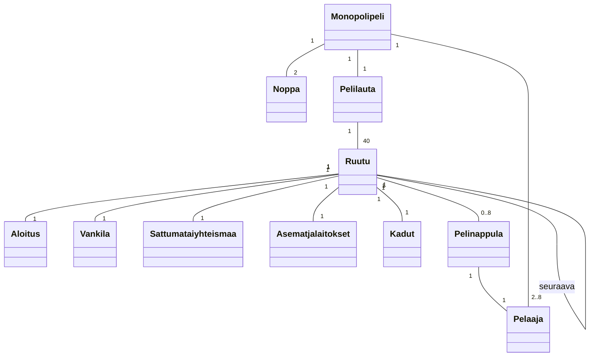

## Monopoli, alustava luokkakaavio

```mermaid
 classDiagram
    Monopolipeli "1" -- "2" Noppa
    Monopolipeli "1" -- "1" Pelilauta
    Pelilauta "1" -- "40" Ruutu
    
    Ruutu "1" -- "1" Aloitus
    Ruutu "1" -- "1" Vankila
    Ruutu "1" -- "1" Sattuma tai yhteismaa
    Ruutu "1" -- "1" Asemat ja laitokset
    Ruutu "1" -- "1" Kadut
    Ruutu "1" -- "0..8" Pelinappula
    Ruutu "1" -- "1" Ruutu : seuraava
    
    Pelinappula "1" -- "1" Pelaaja
    Pelaaja "2..8" -- "1" Monopolipeli
```
